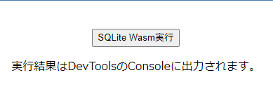
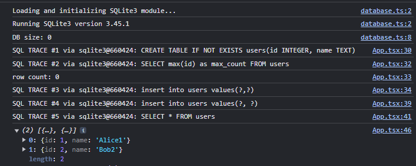
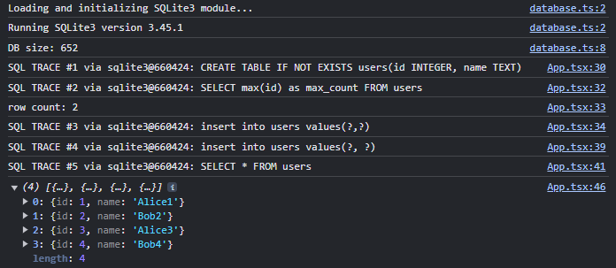

# ReactでSQLite Wasmを実行して、localStorageに永続化する最小のサンプル

## はじめに

[SQLiteの正式なWebAssembly版「SQLite3 WASM/JS」が登場 － Publickey](https://www.publickey1.jp/blog/22/sqlitewebassemblysqlite3_wasmjs.html)

SQLite3をWebAssembly化した「SQLite3 WASM/JS」が気になっていたので、React上で動作するサンプルを作成してみました。
(Web標準になれなかった[Web SQL Database](https://www.w3.org/TR/webdatabase/)の代わりに利用できればと)

SQLite Wasmの実行方法は3つあります。今回は一番単純な「メインスレッドで実行」パターンを試しました

1. [ラップされたWorderをメインスレッドで実行(推奨)](https://www.npmjs.com/package/@sqlite.org/sqlite-wasm#in-a-wrapped-worker-with-opfs-if-available)
1. [Web Workerで実行](https://www.npmjs.com/package/@sqlite.org/sqlite-wasm#in-a-worker-with-opfs-if-available)
1. [メインスレッドで実行](https://www.npmjs.com/package/@sqlite.org/sqlite-wasm#in-the-main-thread-without-opfs)


### 画面 (ボタンを押すだけ、最低限のサンプル)

  


* React環境はViteで作成しています
* localStorageに保存しているため、ブラウザを閉じても永続化されます(最大10MB)

作成したソースはこちら
https://github.com/murasuke/react_wasm_sqlite_step1

## サンプルソースの内容
* WASM版SQLite3をブラウザ上で実行
* localStorageにDBを作成
* テーブル作成
* InsertとSelectを実行してクエリが想定通りに実行されることを確認
* リロードしてもデータが消えないことを確認


## 作成手順

### プロジェクト作成
* viteでReactプロジェクトを作成後、npmでWASM版SQLiteをインストールします

  https://www.npmjs.com/package/@sqlite.org/sqlite-wasm

```bash
$ npm create vite@latest wasm_sqlite_step1  -- --template react-ts
$ cd wasm_sqlite_step1
$ npm install @sqlite.org/sqlite-wasm
```

### SQLite初期化モジュール

* sqlite3InitModule()でSQLiteのロード後、Databaseの読み込みを行う
* 実行したクエリをconsoleに出力する


localStorageを簡単に利用できる`JsStorageDb()`は、SQLのトレースができなかったためやめました

```typescript
  // JsStorageDb()はlocalStorageを簡単に利用できるが、SQLのトレースが利用できない
  db = new sqlite3.oo1.JsStorageDb('local');
```

```typescript:./src/database.ts
import sqlite3InitModule, {
  Database,
  Sqlite3Static,
} from '@sqlite.org/sqlite-wasm';

const log = (...args: any[]) => console.log(...args); // eslint-disable-line
const error = (...args: any[]) => console.error(...args); // eslint-disable-line

let db: Database | null = null;

/**
 * sqlite3に接続してDBを作成
 * ・https://sqlite.org/wasm/doc/tip/api-oo1.md
 * @param sqlite3
 * @returns
 */
const connectDB = (sqlite3: Sqlite3Static) => {
  log('Running SQLite3 version', sqlite3.version.libVersion);

  // localStorageに保存(永続化)
  // (c: DBがなければ作成する, t: 実行したクエリをConsoleへ出力(trace on))
  db = new sqlite3.oo1.DB('file:local?vfs=kvvfs', 'ct');

  // DBサイズ(CスタイルのAPI経由)
  console.log(`DB size: ${sqlite3.capi.sqlite3_js_kvvfs_size()}`);

  // 永続化しない場合
  // db = new sqlite3.oo1.DB('/mydb.sqlite3', 'ct');
  // JsStorageDb()はlocalStorageを簡単に利用できるが、SQLのトレースが利用できない
  // db = new sqlite3.oo1.JsStorageDb('local');
  return db;
};

/**
 * DBが初期化済みであれば閉じる
 */
export const closeDB = () => {
  db?.close();
  db = null;
};

/**
 * DBの初期化と接続を行う
 * @returns Database
 */
export const getDatabase = async (): Promise<Database> => {
  if (db) {
    return db;
  }

  log('Loading and initializing SQLite3 module...');

  try {
    // sqlite3の初期化
    const sqlite3 = await sqlite3InitModule({
      print: log,
      printErr: error,
    });

    // DBに接続
    db = connectDB(sqlite3);

    return db;
  } catch (err: unknown) {
    if (err instanceof Error) {
      error(err.name, err.message);
      throw err;
    }
  }

  throw new Error('unknown error');
};
```

### 画面(App.tsx)でクエリを実行する

* 初回ボタンクリック時、データ登録の前にDBの初期化を行います。
* 2回目以降はデータ追加のみ

```typescript:./src/App.tsx
import { useEffect } from 'react';
import './App.css';
import { getDatabase, closeDB } from './database';

function App() {
  useEffect(() => {
    return () => {
      // clean up
      closeDB();
    };
  }, []);

  const executeQuery = async () => {
    // 初回実行時に生成、以降は生成済みのconnectionを返す
    const db = await getDatabase();

    // テーブル作成
    db.exec('CREATE TABLE IF NOT EXISTS users(id INTEGER, name TEXT)');

    const select_max = 'SELECT max(id) as max_count FROM users';
    const max = (db.selectValue(select_max) as number) ?? 0;
    console.log(`row count: ${max}`);

    // 行追加(exec)
    db.exec({
      sql: 'insert into users values(?,?)',
      bind: [max + 1, `Alice${max + 1}`],
    });

    // 行追加(prepare & bind)
    const stmt = db.prepare('insert into users values(?, ?)');
    stmt.bind([max + 2, `Bob${max + 2}`]).stepReset();
    stmt.finalize();

    // 結果出力
    const values = db.exec({
      sql: 'SELECT * FROM users',
      rowMode: 'object',
      returnValue: 'resultRows',
    });
    console.log(values);
  };

  return (
    <>
      <div>
        <button id="exec" onClick={() => executeQuery()}>
          SQLite Wasm実行
        </button>
        <p>実行結果はDevToolsのConsoleに出力されます。</p>
      </div>
    </>
  );
}

export default App;
```


## 動作確認

* 初回実行時
  * DBサイズ`size`は0byteです
  * テーブル作成＋2行追加されたことが確認できます

  

* 画面をリロードして、再度実行
  * DBサイズ`size`は652byteです
  * 前回追加した2行＋今回追加分の2行が表示されます

  


## 参考サイト

* [npm SQLite Wasm](https://www.npmjs.com/package/@sqlite.org/sqlite-wasm)

* [SQLite: sqlite3 WebAssembly & JavaScript Documentation Index](https://sqlite.org/wasm/doc/trunk/index.md)

* [SQLite: Object Oriented API #1](https://sqlite.org/wasm/doc/tip/api-oo1.md)

* [SQLite: Persistent Storage Options](https://sqlite.org/wasm/doc/trunk/persistence.md)

* [SQLite公式のWASM実装を試す](https://leaysgur.github.io/posts/2022/12/02/134526/)
